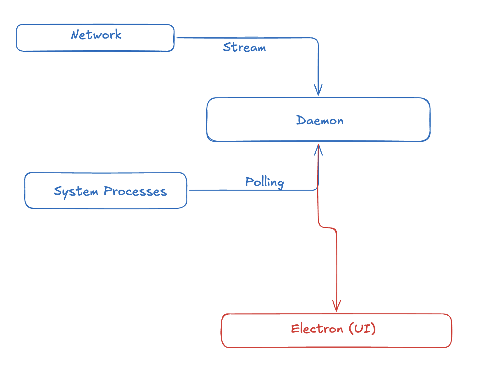

## Network & System Security Agent

Hackathon Page : https://unstop.com/hackathons/cloud-innovation-challenge-jawaharlal-nehru-technological-university-jntuh-hyderabad-1652247

Tech stack :

Backend : Typescript, PostGSQL
UI : Electron (React)
LLM : Deepseek

This project will be a multi agent orchestrated system where multiple agents will be working to analyze the network and system security.

Analyze:-
system processes, network traffic, and security logs to identify potential threats and vulnerabilities.

Basic Diagram

